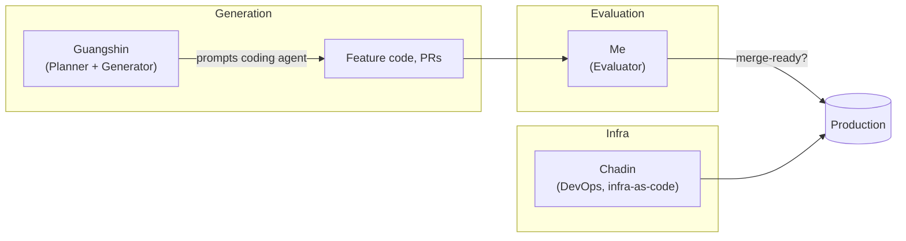
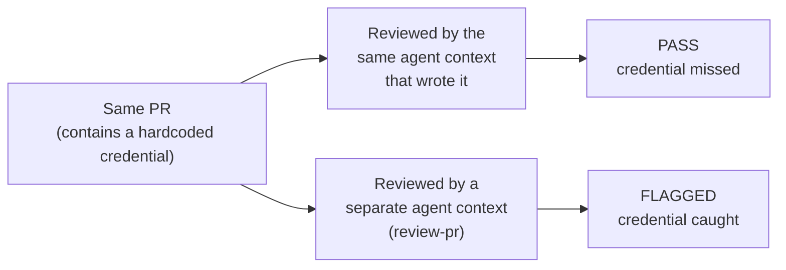
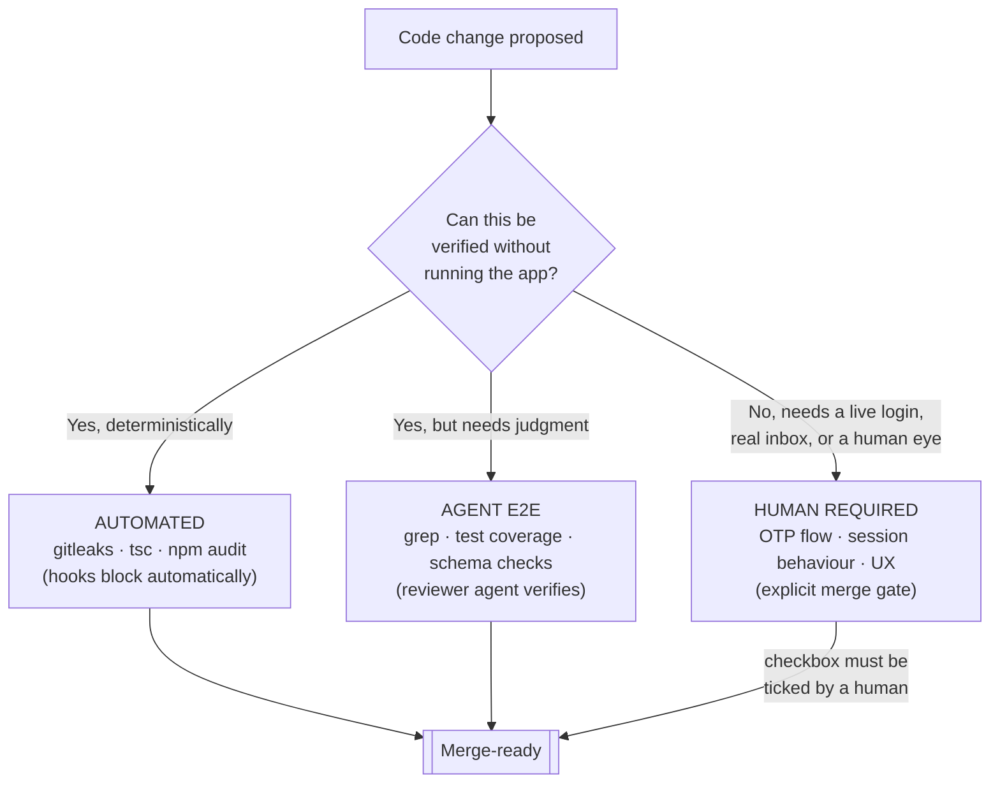
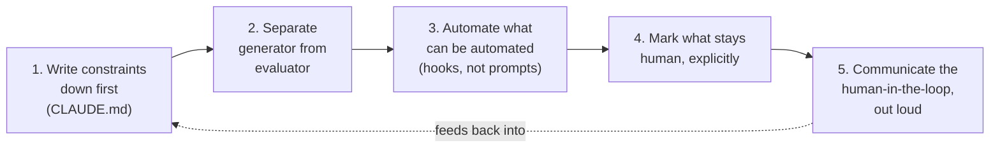

# What I Learned Reviewing an AI-Built Government App

Before a single user had logged in, our AI coding assistant had already committed a live database credential (a Supabase service role key, an admin email, an admin password) in plaintext in a public-facing repository. It sat there for 19 days before I found it through a manual audit.

Nobody had done anything wrong, exactly. Guangshin, our product manager, had spent a build week working with Claude's coding agent to stand up a research management tool from scratch, no engineer in the loop, by design, to test how far a grassroots practitioner could get. The agent shipped fast: working CRUD flows, a login system, admin dashboards, all within days. It also shipped a hardcoded key to the one system that could unlock every row of data in the project.

I was the engineer who joined afterwards to get it production-ready, working alongside Chadin, our DevOps engineer, to review what the agent had built and close the gaps standing between it and a live deployment. What I found, and what we built in response, is the reason I think we, the public service and not just my team, need to be a lot more deliberate about how we let AI write our code.

## The question we were actually testing

Everyone talks about whether AI can write code. That's not really the interesting question anymore; it obviously can, and quickly. The question we were testing was narrower and more consequential: **can a coding agent be trusted to ship code into production without a human software engineer checking its work?**

For six weeks, we ran that experiment for real, on a real government tool, with Guangshin at the wheel and me evaluating what came out the other end.



Three of us each ran our own coding agent, but in distinct roles: one for planning and generating, one for evaluating, one for infrastructure. Some might see that adopting this way of working was similar to what the industry now calls *AI Agent Personas*, which are specialized behavioral profiles that define how AI assistants should approach different types of tasks and interactions (see [this GitHub library of agent personas](https://github.com/mthalman/agent-personas)).  That separation of roles turned out to be the single most important structural decision in the whole trial. 

I want to share what we found, because I think it's a useful, unglamorous data point for anyone in the public service currently deciding how far to hand engineering work to AI.

## Fast, but not safe by default

The agent was good at the things you'd expect: scaffolding features, writing CRUD endpoints, building UI. It moved at a pace no human PM, Guangshin included (and he'd be the first to say so), could match unassisted.

But left to its own defaults, it consistently made choices that were technically sound and organisationally wrong. It reached for Vercel for hosting and Supabase for auth and database: sensible, well-documented, entirely standard choices for a solo builder on the open internet, without any awareness that our production target was a private-cloud Postgres instance on AWS RDS, or that our organisation has real reasons to avoid depositing citizen-facing data with a third-party managed service by default. It chose global SSL certificates without knowing there was a regional preference to ask about.

None of these were malicious or even careless in an obvious sense. The agent doesn't know our infrastructure policy exists unless we tell it. That's the crux of the finding: **an agent's defaults are only as good as the constraints we give it**, and undocumented institutional knowledge, the kind every engineer just "knows," is invisible to it by default.

The credentials incident is the sharper version of the same problem. We told the agent, in plain language, in our project rules, not to hardcode secrets. It still did it. The agent wasn't being defiant; it's a probabilistic system, and a probabilistic system can't guarantee compliance the way a deterministic check can. Instructions nudge behaviour. They don't guarantee it - and they certainly don't guarantee it when you take into account limitations like context windows.

## The generator can't be the evaluator too

My first instinct, like most engineers', was to read every pull request more carefully. That doesn't scale, and worse, it repeats a mistake we'd already made once: relying on a fallible check to catch a class of error that a fallible check will eventually miss.

We tried something else. We let the same agent that generated a piece of code also review its own work, a "pre-merge audit" it ran on itself before I even looked at the PR. It consistently passed things that a completely separate review, run in a fresh agent context by a different operator, immediately flagged. Including, at one point, its own hardcoded credentials.

This wasn't a fluke. [Anthropic has written about the same pattern](https://www.anthropic.com/engineering/harness-design-long-running-apps) in their own agent research: agents evaluating their own output tend to confidently praise it, even when a human would call it obviously mediocre. Separating the agent that does the work from the agent that judges the work is one of the few interventions that reliably fixes this. We saw it hold up under real production conditions, beyond the lab.



Same code, same rules... but two different reviewers. The only variable that changed was whether the reviewer shared context with the generator. That's why the separation is a requirement for us now, not a preference.

So we built two layers, in sequence, each doing a job the other can't:

**Layer one is deterministic automation**: secrets scanning, dependency audits, type checks, wired into commit and push hooks so they run automatically and either pass or block. If you can automate a check instead of instructing an agent to remember it, automate it. Automation gives you a guarantee. Instructions give you a probability, and probabilities compound badly across thousands of commits.

Here's an excerpt from the actual `pre-commit` hook we run on every commit. It's the layer that catches what an instruction alone couldn't:

```sh
# 1. Secret scanning
gitleaks protect --staged --verbose

# Block `any` casts and eslint-disable comments in staged TS/JS additions
if git diff --cached -- '*.ts' '*.tsx' '*.js' '*.jsx' | grep "^+" | grep -E "(eslint-disable|: any|as any)" > /dev/null 2>&1; then
  echo "ERROR: Staged changes contain 'any' cast or eslint-disable comment."
  echo "Model the correct type instead, or ask for clarification."
  exit 1
fi

# Dockerfile: confirm COPY prisma ./prisma is present when Dockerfile is staged
if git diff --cached --name-only | grep -q "^Dockerfile$"; then
  if ! grep -q "COPY prisma ./prisma" Dockerfile; then
    echo "ERROR: Dockerfile is staged but missing 'COPY prisma ./prisma'."
    exit 1
  fi
fi
```

No agent has to remember any of this. It either passes or the commit doesn't happen.

**Layer two is an independent AI reviewer**: a separate context that reads each change against an accumulating rulebook of every failure pattern we'd already seen in this specific codebase. It catches the structural and judgment-based issues the deterministic layer can't: type safety bypasses, duplicated constants, orphaned files, raw error messages leaking to users.

The rulebook itself became the most valuable artefact of the whole trial. Every gap we found, whether by me reading code by hand, by the automated reviewer, or by a user clicking through the app, got written back into it. Taking inspiration from [this research paper on structured agentic software engineering on designing agentic feedback loops](https://arxiv.org/html/2509.06216v3), I even prompted the reviewer to interrogate its own output after every run and propose new rules for patterns it had just caught but didn't yet have codified:

```markdown
### Update `CLAUDE.md`

Add or clarify a rule when a TODO item reveals:
- A violation with no corresponding rule in CLAUDE.md
- An existing rule that is ambiguous in a way the violation exposes

Do not duplicate rules already enforced by husky hooks — CLAUDE.md is the
human-readable statement; the hook is the enforcement.
```

I approve or reject each addition, so a human stays in the loop on what the system learns, but the ruleset compounds without me having to anticipate every future failure mode myself. Six weeks in, it was catching things I hadn't thought to look for.

## Where the human still can't be automated away

Even with both layers running, two bugs made it all the way through static review and passed clean. One was a race condition: a user could click "send OTP" twice fast enough to trigger duplicate codes, because the guard against it relied on a React state update that hadn't rendered yet. The other was a division code stored with different casing than the code checking against it, so a form field failed to save correctly for one specific role, with no error to flag it.

Both bugs were logically invisible to any tool that reads code without running it. Both were obvious within thirty seconds of a human actually using the app.

Automation has an edge, and this is it. We formalised that edge directly into our review skill, classifying every check into one of three tiers:

```markdown
- **[AUTOMATED]** — enforced by a husky pre-commit or pre-push hook. No agent
  or human action is needed beyond confirming the hooks are installed.
- **[AGENT E2E]** — verifiable by shell commands, grep, or automated test
  runs. The agent can execute and evaluate the result without human involvement.
- **[HUMAN REQUIRED]** — requires a human to manually execute and observe.
  Cannot be satisfied by agent tooling.

> Auth flows are always [HUMAN REQUIRED]. Any criterion that passes through
> the login flow — OTP request, OTP delivery, code entry, session creation,
> or logout — must be tested by a human. Agent E2E is structurally blocked:
> OTP delivery requires a real inbox, and OTPaaS requires a government-
> registered email that cannot be provisioned in an automated test environment.
```



We added a hard gate so that boundary couldn't be skipped under deadline pressure. The review skill now appends a literal checklist item to the pull request that only a human can tick:

```markdown
## Human Testing Gate

> This item must be manually checked before merging. The automated PR
> review above does not satisfy this gate.

- [ ] Human testing completed — all `[HUMAN REQUIRED]` criteria in the
      pre-merge audit have been manually verified by a human tester
```

We responded to the two runtime bugs by adding browser-level automated tests that simulate real usage, closing that gap for regressions of the same shape going forward. We also hit a harder limit: any flow that goes through our government single-sign-on can't be driven by an agent at all. The login is deliberately built to resist automation, by design, as a security safeguard. Until we build a sandboxed test environment with safe throwaway credentials, that class of testing stays permanently, structurally human.

## The finding that surprised me the most

Somewhere in the middle of the trial, I noticed that leadership's confidence in the codebase tracked one variable more than any other: whether they'd been told a human engineer was personally reviewing the output. Tests existing didn't move that needle. A green pipeline didn't move it either. A named, accountable person did.

I understand why. Technical assurance and organisational trust run on different currencies. In the public sector, where the cost of a mistake is a citizen's data or a public service outage, accountability carries as much weight as correctness, sometimes more. If we let that trust erode by moving too fast without visibly keeping a human accountable, we lose the room to keep experimenting at all. That's as important a constraint to design around as any technical one.

## What I'd tell another public service engineer starting this

If your organisation is starting to let AI agents write production code, and most of ours will sooner rather than later, here's what I'd actually do differently from day one, rather than discovering it the way we did:



**Write your constraints down before the agent starts, not after.** A `CLAUDE.md`-style project rules file, stating your actual infrastructure, auth, and compliance requirements in plain language, is the cheapest guardrail you'll ever install, and the right place to start on day one. The agent's default choices are built for the general internet. Yours aren't.

Of course, a rules file is a floor, not a ceiling. It's a static document the agent has to remember to consult, which is exactly the failure mode we kept running into. The longer-term fix is turning your team's actual rituals, the ones a rules file can only describe in prose, into skills the agent runs: a repeatable, checkable procedure instead of a paragraph it might skim. That's what `pre-merge-audit` and `review-pr` became for us: a scripted procedure (rebase, scan, classify, gate) that runs the same way every time, on every PR, regardless of who's driving. We did the same to get Guangshin himself set up on the local environment, wrapping the setup ritual into a `run-local` skill so a non-engineer PM could stand up his own local dev environment reliably, instead of a README he'd have to interpret and debug alone. Every recurring judgment call in your SDLC, how you review, how you deploy, how you onboard, is a candidate for a skill, and each one you build is a guardrail that survives being forgotten.

**Never let a generator grade its own homework.** Whatever review process you build, run it in a separate context from whatever wrote the code: a different session, a different operator, ideally both. This is the single highest-leverage lesson from the whole trial.

**Automate anything you can before you instruct an agent to remember it.** Secrets scanning, dependency audits, type checks: put them in hooks that block, not prompts that ask nicely. An instruction is a probability; a gate is a guarantee. For public sector work, where a leaked credential or a compliance breach carries real consequences, that distinction matters in practice, not just on paper.

**Know where human testing is structurally required, and say so out loud.** Not every test can be automated away, especially anything that touches government authentication. Mark it explicitly in your process so "the AI reviewed it" is never mistaken for "a human verified it."

**Communicate the human-in-the-loop, deliberately and often.** Stakeholder trust in this work is fragile and it doesn't move on code quality alone. Say plainly, every time, who is accountable for what shipped.

This trial didn't slow AI adoption down on the project. It gave us a working app, a review system that gets sharper every week without me rewriting it from scratch, and a clear map of where the human still has to stand. We got there by getting precise about exactly what to trust the agent with, and building the structure to enforce it. With this experiment, it has emboldened us to now look at how to implement structured agentic software engineering across our other projects helmed by technical practitioners, and we are looking forward to share our learnings as our experiments yield more results!
