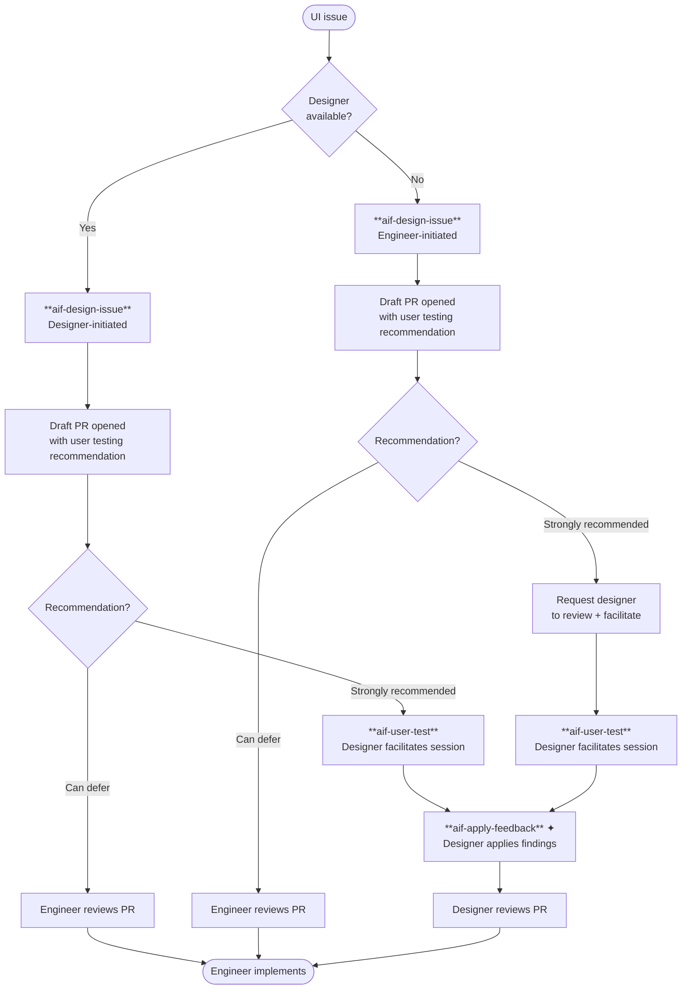
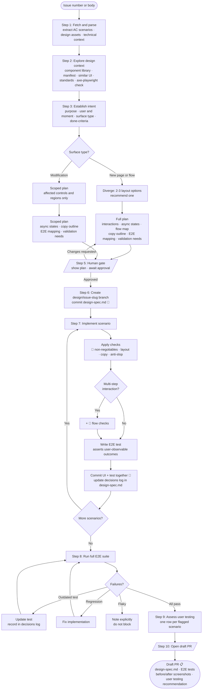

# aif-design-issue

Runs a structured design phase for a GitHub issue before implementation. Reads acceptance criteria, explores existing components, produces a design plan, implements the design in a `design/<issue-slug>` branch with quality checks applied throughout, and opens a draft PR with a user testing recommendation as handoff.

Suitable for engineers and designers alike — the output is always a design branch, E2E tests per AC scenario, and a draft PR.

---

## The design → dev → review cycle

> ✦ `aif-apply-feedback` is planned — not yet available. Until then, apply feedback manually and push to the design branch before marking the PR ready.

---

## Skills in this cycle

| Skill | Run by | When |
|-------|--------|------|
| [`aif-design-issue`](SKILL.md) | Engineer or designer | Before implementation — produces design spec, branch, E2E tests, and draft PR |
| [`aif-user-test`](../aif-user-test/SKILL.md) | Designer (facilitates) | After draft PR opens, for scenarios marked "Strongly recommended" |
| `aif-apply-feedback` *(planned)* | Designer | After user test session — applies findings to the design branch and re-runs checks |

---

## Who reviews the PR?

| Initiated by | User testing recommendation | PR reviewer |
|--------------|----------------------------|-------------|
| Designer | Strongly recommended | Engineer (after designer applies feedback) |
| Designer | Can defer | Engineer |
| Engineer | Strongly recommended | Designer |
| Engineer | Can defer | Engineer |

**The rule:** an engineer-initiated design that flags new patterns or user flows needs a designer in the loop — to facilitate the user test and review the resulting PR. Where the skill cannot fully validate a design decision autonomously, a designer's judgment is the gate before implementation.

---

## Skill flow and artifacts

**Artifacts produced:**

| Artifact | Created at | Lives in |
|----------|------------|---------|
| `design-spec.md` | Step 6, updated throughout Step 7 | Design branch |
| E2E tests | Step 7, one per scenario | Design branch |
| Draft PR | Step 10 | GitHub |

**Reference files loaded during Step 7** (📎 marks):

| File | Loaded when |
|------|-------------|
| [`checks-non-negotiables.md`](reference/checks-non-negotiables.md) | Always |
| [`checks-layout.md`](reference/checks-layout.md) | Always |
| [`checks-copy.md`](reference/checks-copy.md) | Always |
| [`checks-anti-slop.md`](reference/checks-anti-slop.md) | Always |
| [`checks-flow.md`](reference/checks-flow.md) | Multi-step interactions only |

---

## Engineer-initiated flow

Used when no designer is available to design the issue.

1. **Run `aif-design-issue`** with the issue number or pasted body.
2. The skill explores the component library, establishes intent, produces a design plan, and waits for your approval before creating any branch (Step 5 human gate).
3. After approval, the skill creates the `design/<issue-slug>` branch, commits `design-spec.md`, implements each AC scenario with an E2E test, and runs the full suite.
4. Step 9 assesses each flagged scenario and writes a recommendation into the PR body:
   - **Strongly recommended** — the scenario introduces a new pattern or user flow. Request a designer to review the PR and run `aif-user-test` before implementation.
   - **Can defer** — the scenario is a modification to existing UI with clear AC. An engineer can review and implement directly.
5. Open the draft PR. If user testing is strongly recommended, ping a designer. Otherwise, proceed to engineer review and implementation.

---

## Designer-initiated flow

Used when a designer is picking up the issue to design before handing off to an engineer.

1. **Run `aif-design-issue`** with the issue number or pasted body.
2. Work through the plan and human gate (Step 5) — modify the design plan before approving if needed.
3. The skill creates the design branch and implements each scenario. Review the implementation as it goes — the design-spec.md decisions log is updated throughout.
4. Step 9 assesses user testing needs. For scenarios marked "Strongly recommended", run **`aif-user-test`** to set up the session:
   - The skill recommends who to interview, generates a session guide and feedback record, and starts a localtunnel URL to share with the participant.
   - Run the session. Fill in the feedback record during or immediately after.
5. Apply findings to the design branch (manually until `aif-apply-feedback` is available). Push and update the PR.
6. Mark the PR ready for engineer review and implementation.
